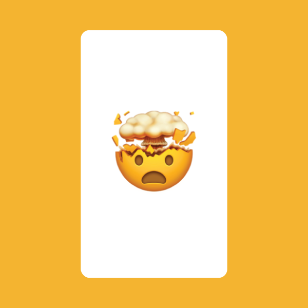
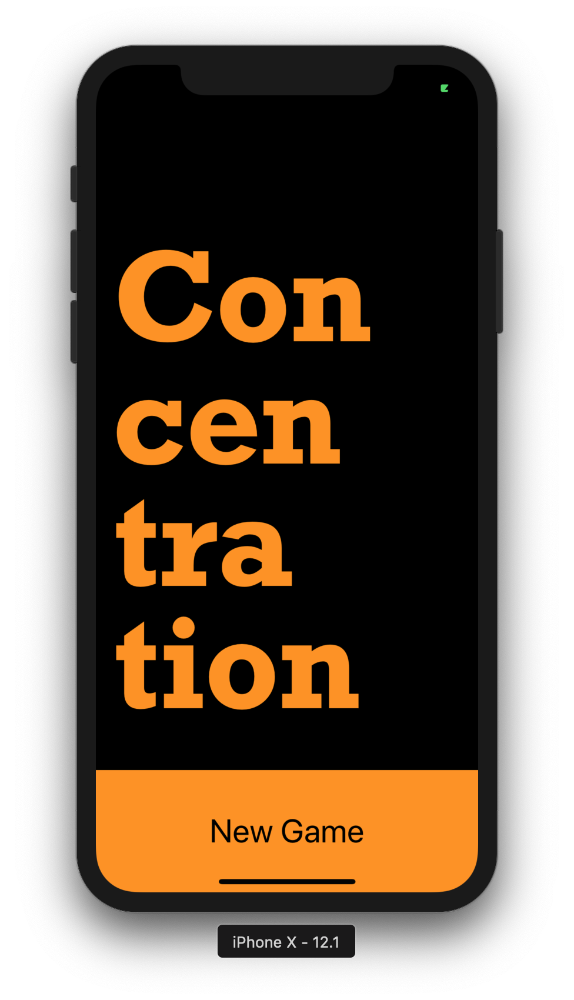
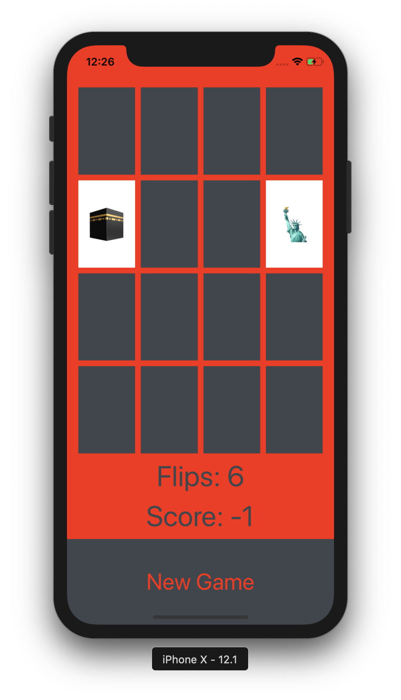
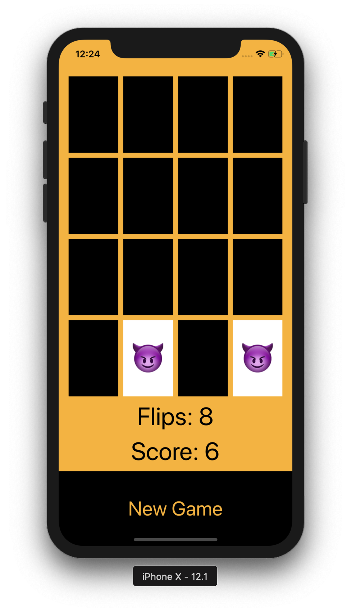
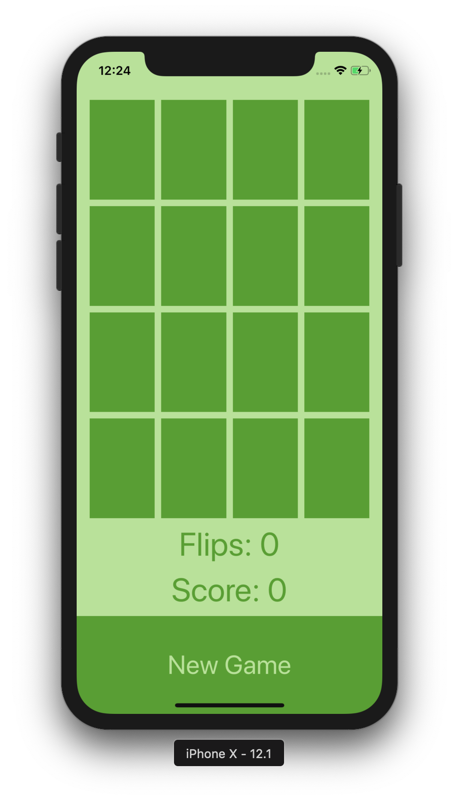
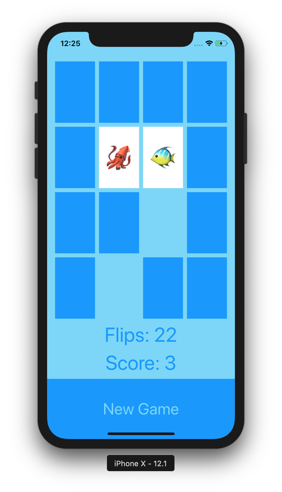

# Concentration

As its name, a version of Concentration game

## Getting Started

Clone the project to where you want to have it on your local machine and run it with Xcode

  

## Rules

- The faster you get the pieces right, the higher score you got
- If you reopen a card that you already open but still cannot solve it, you lose a point for each card

## Quick Look

### Opening

  

### Different game themes

  
      
         

#### And many other themes

## Things that was applied

1. Xcode 9
2. Swift
3. MVC
4. UIViewController subclass
5. UILabel and UIButton
6. Target/Action (@IBAction)
7. Outlets (@IBOutlet) and Outlet Collections
8. functions and properties (instance variables)
9. let versus var
10. Value type (struct, enum) versus reference type (class)
11. Strong typing and type inference
12. didSet
13. for in (and ..< CountableRange syntax)
14. Array<Element> and Dictionary<Key, Value>
15. [Element] and [Key:Value] syntax
16. initialization of struct and class
17. viewDidLoad
18. Optionals (including implicitly-unwrapped Optionals
19. ?? optional defaulting operator
20. // TODO
21. arc4random()
22. Type conversion (e.g. from UInt to Int)
23. Stack View and (simple) autolayout

## Versions

* **Version 1.0:** 

## Author

* [**Nhan Cao**](https://www.linkedin.com/in/nhan-cao/)
